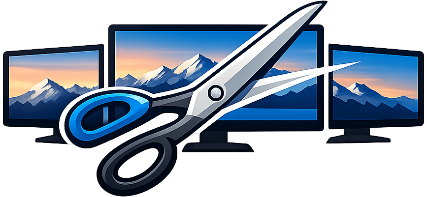

<p align="center">
	<a href="https://ghcr.io/hoesentoet/wallpaper-cutter">
	
	</a>
	
	
	
	
</p>

# Multi-Monitor Wallpaper Cutter

A lightweight, browser-based tool to **slice ultra‑wide or high‑resolution wallpapers** into perfectly aligned per‑monitor images.

The application is completely client‑side (no backend processing) and can be run locally, via Docker, or deployed on any server with ease.

---
## ✨ Features

* Visual preview of monitor layout over the original image
* Zoom & pan the **monitor arrangement** (image always stays fixed)
* Fine zoom using **CTRL + Mouse Wheel**
* Live resolution calculation per monitor
* Warning when a monitor receives less source resolution than its native resolution
* ZIP download containing one wallpaper per monitor
* Fully client‑side (no uploads to a server)

---

## 🚀 Usage (For End Users)

### 1. Load a Wallpaper Image

* Click **"Load Image"** and select your wallpaper file
* Large images (8K / 16K) are fully supported

### 2. Load Monitor Configuration (JSON)

* Click **"Load Monitor JSON"** and select your monitor layout file
* The monitor layout will be drawn on top of the image

### 3. Adjust Layout

* **Mouse drag** → move the entire monitor group
* **Mouse wheel** → zoom monitor layout
* **CTRL + Mouse wheel** → fine zoom
* **Reset View** → reset zoom and position

### 4. Check Resolution Quality

Below the canvas, each monitor shows:

```
Selection 5120×1440 → Monitor 5120×1440 ✓
```

If the selection resolution is too small:

```
Selection 3200×900 → Monitor 5120×1440 ⚠️
```

You can still export, but quality may suffer.

### 5. Render & Download

* Click **"Render & Download"**
* A ZIP file containing one PNG per monitor is generated

---

## 🧾 Monitor Configuration JSON

The monitor configuration describes **physical size, position, and resolution** of each display.

### Example

```json
[
  {
    "name": "Left",
    "mm": [600, 340],
    "px": [2560, 1440],
    "offset": [0, 0]
  },
  {
    "name": "Center",
    "mm": [700, 400],
    "px": [3440, 1440],
    "offset": [600, 0]
  },
  {
    "name": "Right",
    "mm": [600, 340],
    "px": [2560, 1440],
    "offset": [1300, 0]
  }
]
```

### Field Explanation

| Field    | Description                                                                    |
| -------- | ------------------------------------------------------------------------------ |
| `name`   | Display name (used in preview & filenames)                                     |
| `mm`     | Physical size of the monitor **panel** `[width, height]` in millimeters        |
| `px`     | Native resolution `[width, height]` in pixels                                  |
| `offset` | Position in millimeters measured from the top‑left corner of the monitor panel |

> 💡 **Tip:** Use real physical measurements for best alignment accuracy.

---

## 🐳 Running with Docker (Recommended)

The application is published as a ready‑to‑use Docker image:

```
ghcr.io/hoesentoet/wallpaper-cutter:latest
```

### Docker Compose Setup

Create a `docker-compose.yml`:

```yaml
version: "3.9"

services:
  wallpaper-cutter:
    image: ghcr.io/hoesentoet/wallpaper-cutter:latest
    container_name: wallpaper-cutter
    ports:
      - "8080:80"
    restart: unless-stopped
```

### Start the Container

```bash
docker compose up -d
```

Open in your browser:

```
http://localhost:8080
```

---

## 🧪 Local Development (Without Docker)

You can also run it directly:

```bash
python -m http.server 8080
```

Then open:

```
http://localhost:8080
```

---

## 🔒 Privacy & Security

* All processing happens **inside your browser**
* Images are never uploaded
* ZIP generation is fully client‑side

---

## 🛠 Tech Stack

* Vanilla HTML / CSS / JavaScript
* HTML5 Canvas
* JSZip (ZIP generation)
* NGINX (Docker image)

---

## 📄 License

MIT License

---

## ❤️ Credits

I vibe-coded this entire thing on the side because I needed a quick solution for my wallpapers. Turns out, it's far from perfect but it gets the job done pretty well, so I decided to make it available to the public.

Feel free to use, modify, and contribute.

Built for people who care about **pixel‑perfect multi‑monitor wallpapers**.

Enjoy! 🖥️✨
